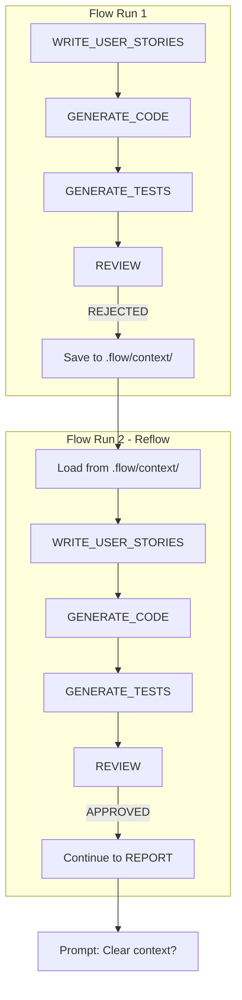

# Context Injection

## Overview

Context injection enables agents to learn from previous attempts by receiving outputs from other agents across reflows and runs. When REVIEW rejects an implementation, subsequent attempts can see exactly what went wrong and fix it.

This replaces the previous "files as memory" approach where agents were instructed to read report files manually. Now, context injection is automatic and configurable per agent.

## The Problem

When REVIEW rejects and triggers a reflow:

1. The `agentResults` array is cleared
2. Agents restart without knowing why they failed
3. They may make the same mistakes again

Similarly, across separate `flow dev` invocations, agents couldn't learn from previous runs.

## The Solution

Introduce `.flow/context/` as ephemeral working memory that persists agent outputs across reflows and runs, with configurable injection per agent.



Directory structure:

```
.flow/context/
├── WRITE_USER_STORIES.md
├── GENERATE_CODE.md
├── PLAN_TESTS.md
├── GENERATE_TESTS.md
├── REVIEW.md
├── CLEAN_AND_REFACTOR.md
└── REPORT.md
```

Each agent's output is saved after it completes. On the next run or reflow, agents can be configured to receive specific outputs from previous attempts.

## Configuration

Add `context_injection` to agent definitions in `.flow/flow.config.mjs`:

```javascript
{
  name: 'GENERATE_CODE',
  goal: 'Write the implementation',
  context_injection: {
    REVIEW: true,   // Inject REVIEW output on reflow
    REPORT: false,  // Don't need previous report
  },
  // ...rest of config
}
```

Keys are agent names, values are booleans:
- `true` - Inject this agent's output if available
- `false` - Do not inject (explicit skip)
- Omitted - Do not inject (default)

### Recommended Configuration

| Agent | REVIEW | REPORT | Rationale |
|-------|--------|--------|-----------|
| WRITE_USER_STORIES | true | true | Needs both for learning |
| GENERATE_CODE | true | false | Gets specific code issues |
| GENERATE_TESTS | true | false | Gets specific test failures |
| PLAN_TESTS | - | - | Read-only, uses natural flow |
| REVIEW | - | - | Generates the feedback |
| CLEAN_AND_REFACTOR | - | - | Runs after REVIEW passes |
| REPORT | - | - | Runs last |

## CLI Commands

### Fresh Start

Clear existing context before running:

```bash
flow dev --clear-context "Build a calculator"
```

### Standalone Clear

Clear context without starting a flow:

```bash
flow clear-context
```

### Normal Run

Uses existing context if present:

```bash
flow dev "Build a calculator"
```

## Behavior Summary

| Scenario | Context State | Behavior |
|----------|---------------|----------|
| Fresh run, no context | Empty | Clean start |
| REVIEW rejects | Saved | Next iteration gets REVIEW feedback |
| User re-runs `flow dev` | Persists | Picks up previous context |
| Run succeeds | Exists | Prompt: "Clear context? (y/n)" |
| `--clear-context` flag | Deleted | Fresh start |
| Non-interactive mode | Auto-clear | Clears on success without prompt |

## How It Works

### Saving Context

After each agent completes, its output is saved:

```javascript
// In flow-runner.mjs
await this._saveAgentContext(agentName, result.finalMessage)
```

Files are saved to `.flow/context/{AGENT_NAME}.md`.

### Loading Context

Before an agent runs, context is injected based on its configuration:

```javascript
// In _prepareAgentInput()
for (const [sourceAgent, shouldInject] of Object.entries(injection)) {
  if (!shouldInject) continue
  const content = await this._loadAgentContext(sourceAgent)
  if (content) {
    contextPrefix += `## ${sourceAgent} OUTPUT (from previous attempt)\n`
    contextPrefix += content
    contextPrefix += `\n---\n\n`
  }
}
```

### Clearing Context

On successful flow completion, users are prompted:

```
Flow completed successfully. Clear working context? (y/n):
```

In non-interactive mode (`--yes` or `AUTO_APPROVE=true`), context is auto-cleared.

## Traces

Injected context appears in trace files under the "User Input" section. Since `_prepareAgentInput()` prepends the context to the agent's input, traces will show:

```markdown
## User Input

## REVIEW OUTPUT (from previous attempt)
STATUS: REJECTED
- Test X fails because...
- Missing acceptance criterion for...
---

Original User Request:
Build a calculator...
```

This provides full visibility into what context each agent received.

## Directory Lifecycle

| Event | Effect on `.flow/context/` |
|-------|---------------------------|
| Agent completes | Output saved/overwritten |
| Flow succeeds | User prompted to clear |
| `--clear-context` | Deleted before run |
| `flow clear-context` | Deleted |
| Flow fails | Preserved for next attempt |

## Comparison to Previous Approach

| Aspect | Old ("files as memory") | New (context injection) |
|--------|------------------------|------------------------|
| Mechanism | Templates instructed agents to read files | Orchestrator injects automatically |
| Reliability | Depended on agent following instructions | Guaranteed injection |
| Configuration | None (hardcoded in templates) | Per-agent `context_injection` config |
| Visibility | Hidden in agent behavior | Explicit in config and traces |

## Troubleshooting

### Context not being injected

1. Check agent has `context_injection` in config
2. Verify the source agent's output exists in `.flow/context/`
3. Check traces to see what input agent received

### Stale context from unrelated task

Use `--clear-context` flag or `flow clear-context` command to start fresh.

### Context too large

Context files are complete agent outputs. If they become too large:
1. Consider which agents really need injection
2. Set `REPORT: false` if full reports aren't needed
3. Clear context more frequently
