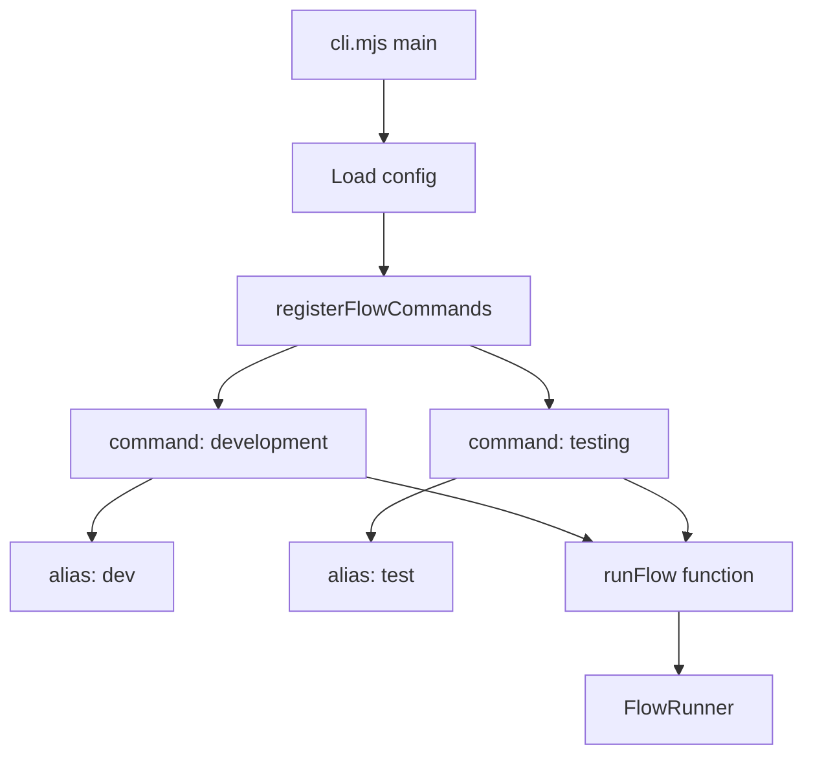

# Dynamic Flow Commands

Flow commands are dynamically registered from your configuration file. Each flow becomes its own CLI command with optional aliases.

## Usage

```bash
# Development flow (full pipeline)
flow dev "Create a calculator with add and subtract"
flow development "Create a calculator with add and subtract"

# Testing flow (tests only, no new code)
flow test "Fix the square root edge case"
flow testing "Fix the square root edge case"

# With auto-approve (non-interactive)
flow dev -y "Add multiply function"
flow test --yes "Fix failing tests"
```

## Available Commands

Run `flow --help` to see all available commands:

```
Commands:
  init                                     Initialize flow in current directory
  resume [run-id]                          Resume a flow from checkpoint
  mode <agent-name> <input>                Run a single agent mode for debugging
  prompts                                  Display all agent prompts
  list                                     List available checkpoints
  cleanup                                  Kill any stuck MCP server processes
  development|dev [options] <description>  Develop features with tests.
  testing|test [options] <description>     Write and fix tests only (no new code).
  help [command]                           display help for command
```

## Configuration

Flows are defined in `.flow/flow.config.mjs`:

```javascript
export default {
  default_flow: 'development',

  flows: {
    development: {
      description: 'Develop features with tests.',
      aliases: ['dev'],
      max_flow_runs: 3,
      ask_before_reflow: true,
      agents: [
        'WRITE_USER_STORIES',
        'GENERATE_CODE',
        'PLAN_TESTS',
        'GENERATE_TESTS',
        'REVIEW',
        'CLEAN_AND_REFACTOR',
        'REPORT',
      ],
    },
    testing: {
      description: 'Write and fix tests only (no new code).',
      aliases: ['test'],
      max_flow_runs: 2,
      ask_before_reflow: true,
      agents: [
        'GENERATE_TESTS',
        'REVIEW',
        'CLEAN_AND_REFACTOR',
        'REPORT',
      ],
    },
  },

  agents: [
    // Agent definitions...
  ],
}
```

### Flow Properties

| Property | Type | Description |
|----------|------|-------------|
| `description` | string | Shown in CLI help output |
| `aliases` | string[] | Short names for the command (e.g., `['dev']`) |
| `max_flow_runs` | number | Maximum reflow attempts before giving up |
| `ask_before_reflow` | boolean | Prompt user before starting a reflow |
| `agents` | string[] | Ordered list of agents to execute |

## Adding Custom Flows

You can add your own flows by adding entries to the `flows` object:

```javascript
flows: {
  // ... existing flows ...

  refactor: {
    description: 'Clean up and refactor existing code.',
    aliases: ['ref'],
    max_flow_runs: 2,
    ask_before_reflow: true,
    agents: [
      'REVIEW',
      'CLEAN_AND_REFACTOR',
      'REPORT',
    ],
  },

  quickfix: {
    description: 'Fast bug fix without full test suite.',
    aliases: ['qf', 'fix'],
    max_flow_runs: 1,
    ask_before_reflow: false,
    agents: [
      'GENERATE_CODE',
      'REVIEW',
      'REPORT',
    ],
  },
}
```

After adding a flow, it automatically becomes a CLI command:

```bash
flow ref "Extract common utilities"
flow qf "Fix null pointer in login handler"
```

## Architecture



### How It Works

1. **CLI Startup**: The `main()` function calls `registerFlowCommands()` before parsing arguments
2. **Config Loading**: Attempts to load `.flow/flow.config.mjs`, falls back to defaults if not found
3. **Command Registration**: For each flow in config, registers a Commander.js command with:
   - The flow name as the command
   - Aliases from `flowConfig.aliases`
   - Description from `flowConfig.description`
4. **Execution**: When invoked, the command calls `runFlow(flowName, description, options)`
5. **FlowRunner**: The shared `runFlow()` function creates a `FlowRunner` instance and executes the flow

### Fallback Behavior

If no config file exists (e.g., before running `flow init`), the CLI registers default commands for `development` and `testing` so that `flow --help` still shows useful output.
